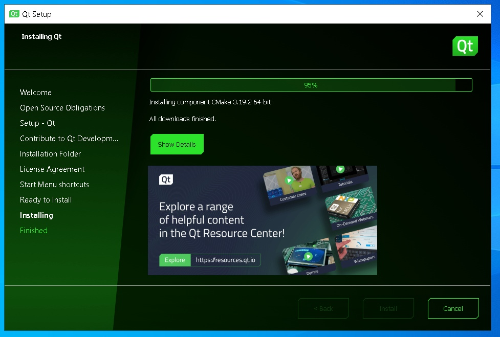
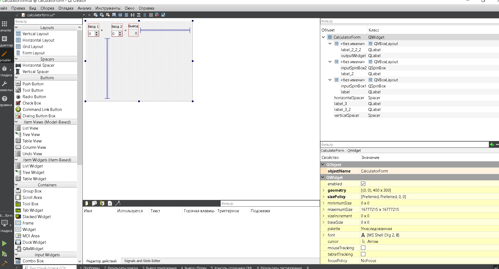

МИНИСТЕРСТВО НАУКИ  И ВЫСШЕГО ОБРАЗОВАНИЯ РОССИЙСКОЙ ФЕДЕРАЦИИ 
Федеральное государственное автономное образовательное учреждение высшего образования 
"КРЫМСКИЙ ФЕДЕРАЛЬНЫЙ УНИВЕРСИТЕТ им. В. И. ВЕРНАДСКОГО" 
ФИЗИКО-ТЕХНИЧЕСКИЙ ИНСТИТУТ 
Кафедра компьютерной инженерии и моделирования

 
<h3 align="center">Отчёт по лабораторной работе № 4  по дисциплине "Программирование"</h3>
  

студента 1 курса группы ПИ-б-о-201(2) 
Фандеев Иван Николаевич 
направления подготовки 09.03.04 "Программная инженерия"

  
<table>
<tr><td>Научный руководитель  старший преподаватель кафедры  компьютерной инженерии и моделирования</td>
<td>(оценка)</td>
<td>Чабанов В.В.</td>
</tr>
</table>
  

Симферополь, 2021

<h2>Постановка задачи</h2>

Настроить рабочее окружение, для разработки программного обеспечения при помощи Qt и IDE Qt Creator, а также изучить базовые возможности данного фреймворка.

<h2>Выполнение работы</h2>

### Задание 1
1. Я скачал и установил с официального сайта последнюю версию Qt creator (при помощи MinGW).

Рисунок 1. Установка Qt creator

2. Я открыл пример проекта "Calculator Form Example" и изменил текст форм "Input 1", "Input 2" и "Output" на "Ввод 1", "Ввод 2" и "Вывод".

Рисунок 2. Работа с редактором форм Qt Creator

### Задание 2
1. **Как изменить цветовую схему (оформление) среды?** 
Перейти по:
Инструменты -> Параметры -> Среда -> Интерфейс -> Тема

2. **Как закомментировать/раскомментировать блок кода средствами Qt Creator? Имеется ввиду комбинация клавиш или пункт меню.** 
С помощью комбинации: Ctrl + /

3. **Как открыть в проводнике Windows папку с проектом средствами Qt Creator?** 
В редакторе выбрать файл (файл проекта также подойдет) -> нажать по нему ПКМ -> `Открыть в проводнике`

4. **Какое расширение файла-проекта используется Qt Creator? Может быть несколько ответов.** 
`<имя проекта>.pro` для сборщика QT 
`CMakeLists.txt` для сборщика CMake, а также файлы `*.cmake` для библиотек.

5. **Как запустить код без отладки?** 
Нажать на иконку зеленого треугольниука снизу слева или Сборка -> Запустить (Ctrl+R)

6. **Как запустить код в режиме отладки?** 
Нажать на иконку зелёного треугольника с жучком слева снизу или Отладка -> Начать отладку -> Начать отладку запускающего проекта (F5)

7. **Как установить/убрать точку останова (breakpoint)?** 
Нажать слева от строки либо переместить курсор на нужную строку и нажать Отладка -> Поставить/снять точку останова (F9)

### Задание 3
**Чему равны переменные i и d в 6 строке?** 
- d = 4.7952351524781363e-317  
- i = 0

**Чему равны переменные i и d в 7 строкe?** 
- d = 4.7952351524781363e-317 
- i = 5

**Чему равны переменные i и d в 8 строке?** 
- d = 5 
- i = 5

Каталог с Заданием 3:
[[Задание 3]](./C++)

## Вывод
В ходе данной лабораторной работы я ознакомился с QT и IDE QT Creator и изучил базовые возможности этого фреймворка. 
